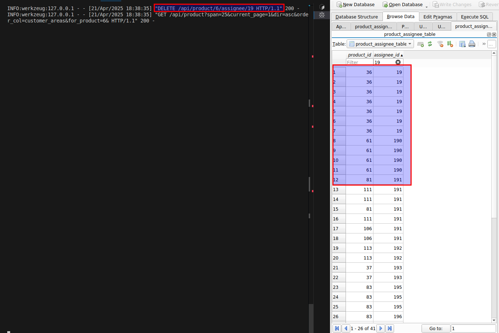

# Flow of Unassignment

## Use Case 1 - Many-to-Many (M2M)

### Description
User **19 (pazosmom)** is part of multiple projects:
- **Project 6**: Kidney Klinrisk Algorithm
- **Project 36**: navify Analytics for Core Lab

### Actions
1. Unassigning User **19** from **Project 6** (Kidney Klinrisk Algorithm).

#### Visuals
- **User and Product Relationship**  
  **Bug: Duplicate rows found for product and assignee.**

  

- **Unassigning User 19**  
  

---

## Use Case 2 - One-to-One (1:1)

### Description
User **610 (liartegj)** is part of a single project:
- **Project**: CGM OTC

### Actions
1. Unassigning User **610** from the single project.

#### Visuals
- **Project Overview**  
  

- **Unassigning User 610**  
  
